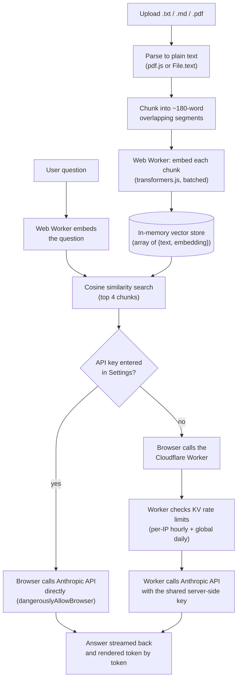

# RAG Chat

A retrieval-augmented chatbot that runs as a static site (GitHub Pages) plus one small
Cloudflare Worker for the free shared demo. Upload a document, ask questions about it, get
answers grounded in the retrieved excerpts.

**Live demo:** https://nathanfarr89.github.io/ai-rag-chat/

## Overview

- Upload a `.txt`, `.md`, or `.pdf` file. It's parsed and split into chunks in your browser.
- Chunks are embedded in a Web Worker with [transformers.js](https://huggingface.co/docs/transformers.js) (`Xenova/all-MiniLM-L6-v2`, running on WASM — no API calls, no cost, and off the main thread so large documents don't freeze the tab).
- Asking a question embeds it the same way, retrieves the most relevant chunks by cosine similarity, and sends them as context to Claude.
- **No key needed to try it**: with the Settings key field left blank, chat requests go through a small Cloudflare Worker ([worker/](worker/)) that holds a shared, rate-limited Anthropic key so visitors can use the demo with zero setup.
- **Bring your own key for unlimited use**: pasting an Anthropic API key into Settings switches to calling the Claude API directly from the browser with that key (stored only in `localStorage`), bypassing the shared demo's rate limits and unlocking the model picker.

## Tech stack

| Layer | Choice |
|---|---|
| Frontend | React 19 + TypeScript, built with Vite |
| PDF parsing | `pdfjs-dist` (Mozilla's PDF.js) |
| Embeddings | `@huggingface/transformers` (transformers.js) running `Xenova/all-MiniLM-L6-v2` via ONNX Runtime Web (WASM), in a dedicated Web Worker |
| Retrieval | Hand-rolled cosine similarity over an in-memory array — no vector database |
| LLM | Anthropic Claude API (`@anthropic-ai/sdk`), called with streaming |
| Shared-demo backend | Cloudflare Workers + Workers KV (rate-limit counters) |
| Hosting | GitHub Pages (static site) + GitHub Actions (CI/CD) |

## Architecture

Two things happen at different times: **indexing** (once, when a document is uploaded) and
**querying** (once per question). Everything in indexing and retrieval happens client-side;
only the final "generate an answer" step ever leaves the browser.



**Indexing** (`src/components/FileUpload.tsx` → `src/lib/chunking.ts` → `src/lib/embeddings.ts` → `src/lib/embeddingWorker.ts`): the file is read, split into overlapping word-count chunks, and each chunk is embedded into a 384-dimensional vector. This all runs in a Web Worker so the main thread — and the UI — stays responsive no matter how large the document is.

**Querying** (`src/components/ChatWindow.tsx` → `src/lib/claude.ts`): the question is embedded the same way, compared against every chunk's embedding with cosine similarity, and the top 4 chunks are stitched into a prompt. From there the request goes one of two ways depending on whether a key is present — see [`src/lib/claude.ts`](src/lib/claude.ts) for both code paths side by side.

## Key design decisions

**Why no backend for retrieval.** GitHub Pages only serves static files. Rather than stand up a
server just to hold a vector index, the whole indexing/retrieval pipeline runs in the visitor's
own browser: a small embedding model (~90 MB, cached after first load) does the work, and cosine
similarity over a few hundred vectors is fast enough in plain JavaScript that no vector database
is needed. This also means uploaded documents never leave the visitor's machine unless they ask
a question about them.

**Why a Web Worker for embeddings.** The first version ran embedding inference on the main
thread. Small documents were fine, but a large PDF froze the tab (Chrome's "Page Unresponsive"
dialog) and, under enough load, crashed the tab outright — hundreds of sequential single-text
WASM inference calls were both blocking the UI thread and growing the WASM heap unboundedly.
The fix was twofold: move all embedding work into a dedicated Worker (`src/lib/embeddingWorker.ts`)
so the UI thread is never blocked, and batch chunks through the model 16 at a time instead of one
call per chunk, which cut the number of WASM session runs drastically and kept memory stable.
There's also a hard cap of 500 chunks per document as a backstop against pathological inputs.

**Why cosine similarity by hand instead of a vector database.** At the scale of one document
(tens to low hundreds of chunks), a linear scan computing a dot product against every chunk is
fast and simple. Embeddings are L2-normalized at generation time, so cosine similarity reduces to
a plain dot product — no separate normalization step needed at query time. A real production
system indexing many documents or needing persistence would reach for a proper vector store
instead.

**Why word-count chunking with overlap.** Chunks are ~180 words with a 30-word overlap
(`src/lib/chunking.ts`), roughly paragraph-aware. The overlap means an idea that spans a chunk
boundary is still likely to appear in full in at least one chunk. This is a simple heuristic, not
token-aware or semantic chunking — good enough for prose documents, but a naive split point compared
to sentence- or section-boundary-aware chunking.

**Why the system prompt is deliberately restrictive.** The prompt instructs Claude to answer only
from the provided excerpts and say so when the answer isn't there (`src/lib/claude.ts`), which
matters more here than in a general chat app: retrieval can miss the relevant chunk, and a model
that fills gaps confidently would be indistinguishable from one that retrieved correctly.

**Why streaming.** Responses render token-by-token rather than waiting for the full completion,
which matters most on the shared demo where the model is optimized for speed (Haiku) but network
and queueing latency still add up — streaming gets something on screen immediately instead of a
multi-second blank wait.

**Why bring-your-own-key *and* a shared proxy, not just one.** Pure BYOK is the simplest possible
architecture (zero backend, zero cost, calls Anthropic directly from the browser with
`dangerouslyAllowBrowser: true`) but it has a real adoption problem for a portfolio piece: a
Claude Pro subscription doesn't include API credits, so a recruiter clicking the link would need
to go set up and fund their own developer account just to try it — most won't. The Cloudflare
Worker exists purely to remove that friction: it holds one funded key server-side so anyone can
try the demo with zero setup, while BYOK stays available underneath for unlimited use and model
choice.

**Why Cloudflare Workers for the proxy** (over a Node server, Vercel/Netlify functions, or AWS
Lambda): free tier is generous for a low-traffic demo, cold starts are effectively nonexistent
(V8 isolates, not containers), and Workers KV gives a built-in key-value store for rate-limit
counters without provisioning a separate database.

**Why two rate limits, not one.** The Worker enforces both a per-visitor-IP hourly cap (20
requests) and a global daily cap (300 requests) — see `worker/src/index.ts`. The per-IP limit
stops one visitor from hammering the demo; the global cap is the real backstop, since it bounds
the worst-case daily spend on the shared key regardless of how requests are distributed (e.g.
across many IPs). Both are simple fixed-window counters in KV with `expirationTtl` doing the
cleanup — no cron job or manual reset needed.

**Why the shared demo always uses a fixed cheap model.** The Worker ignores whatever model a
BYOK visitor might have selected and always calls `claude-haiku-4-5` (configurable via the
`MODEL` var in `worker/wrangler.jsonc`), because that key is funded by the site owner, not the
visitor — the model picker in Settings only takes effect once a personal key is entered.

## Local development

```bash
npm install
npm run dev
```

With no `VITE_PROXY_URL` set, the app has no shared demo to fall back to — you'll need to paste
your own API key in Settings to chat locally, or run the worker too (see below).

## Deploying

### 1. The static site (GitHub Pages, free)

1. Create a GitHub repository and push this project to its `main` branch.
2. If your repo name isn't `ai-rag-chat`, update the `base` path in [vite.config.ts](vite.config.ts) to match: `/<your-repo-name>/`.
3. In the repo's **Settings → Pages**, set **Source** to **GitHub Actions**.
4. Push to `main` — the included workflow ([.github/workflows/deploy.yml](.github/workflows/deploy.yml)) builds and deploys automatically.
5. Your site will be live at `https://<your-username>.github.io/<your-repo-name>/`.

### 2. The shared-demo proxy (Cloudflare Workers, free tier)

This step is optional — skip it and the site still works, just BYOK-only (visitors need their own key).

```bash
cd worker
npm install
npx wrangler login                              # one-time, opens a browser to authorize
npx wrangler kv namespace create RATE_LIMIT_KV  # prints a namespace id
```

1. Put that namespace id into `worker/wrangler.jsonc` under `kv_namespaces[0].id`.
2. Update `ALLOWED_ORIGIN` in `worker/wrangler.jsonc` to your actual GitHub Pages origin (e.g. `https://<your-username>.github.io`).
3. Set your Anthropic key as a secret (never committed): `npx wrangler secret put ANTHROPIC_API_KEY`.
4. Deploy: `npx wrangler deploy` — it prints the Worker's URL (`https://ai-rag-chat-proxy.<your-subdomain>.workers.dev`).
5. Back in the main repo, add a GitHub Actions **repository variable** named `VITE_PROXY_URL` set to that URL (**Settings → Secrets and variables → Actions → Variables**).
6. Push any commit (or re-run the workflow) so the site rebuilds with `VITE_PROXY_URL` baked in.

## Repo layout

```
src/
  components/       UI: SettingsPanel, FileUpload, ChatWindow
  lib/
    pdf.ts              PDF -> text (pdf.js)
    chunking.ts         text -> overlapping word chunks
    embeddingWorker.ts  runs in a Worker: loads the model, embeds in batches
    embeddings.ts       main-thread RPC wrapper around the worker + cosine similarity
    claude.ts           builds the prompt, picks BYOK vs proxy, streams the answer
    storage.ts          localStorage helpers for the API key and model choice
worker/
  src/index.ts      Cloudflare Worker: CORS, KV rate limiting, proxies to Anthropic
  wrangler.jsonc    Worker config (KV binding, allowed origin, default model)
.github/workflows/deploy.yml   builds the site and deploys it to GitHub Pages
```

## Known limitations / possible extensions

- **Rate limiting is IP-based**, which is a coarse proxy for "one visitor" — it can
  under-penalize a determined abuser rotating IPs, or over-penalize several legitimate visitors
  behind the same NAT/VPN. A production version might add a lightweight browser-side token or a
  challenge (e.g. Cloudflare Turnstile) instead of relying on IP alone.
- **No persistence.** Chat history and the document index live only in React state — refresh the
  page and both are gone. This is partly a deliberate privacy choice (nothing is stored anywhere
  once you close the tab), but it also means no multi-session or multi-document support.
- **Retrieval is a naive top-k cosine similarity scan**, with no re-ranking, no hybrid
  keyword+vector search, and no dedup of near-identical chunks.
- **Chunking is word-count based**, not token- or sentence-boundary-aware, so a chunk can split
  mid-sentence.
- **No automated test suite** — behavior was verified through manual and browser-automated
  testing during development rather than a checked-in test suite.
- **The Worker deploy is manual** (`wrangler deploy`), unlike the frontend which redeploys
  automatically on every push. A second GitHub Actions workflow with a `CLOUDFLARE_API_TOKEN`
  secret could automate it.
- **The 500-chunk cap** on very large documents just takes the first 500 chunks in document
  order — there's no smarter sampling or prioritization for documents that exceed it.
